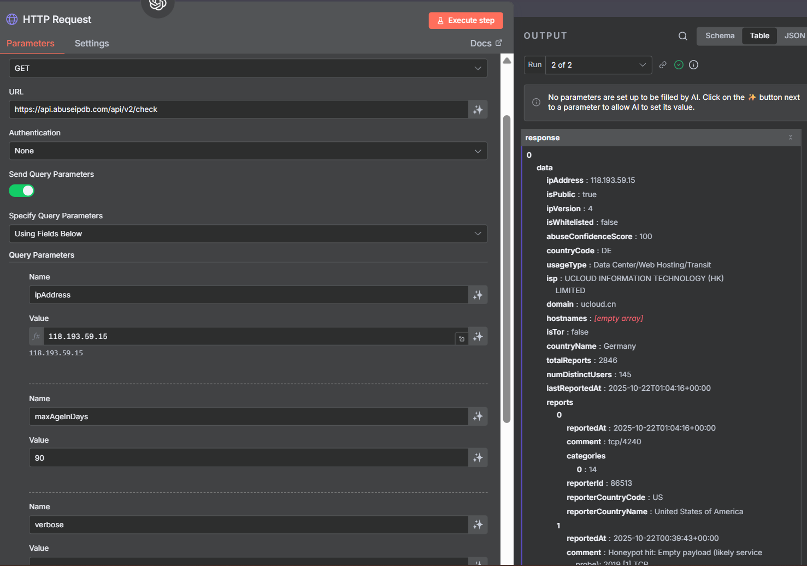
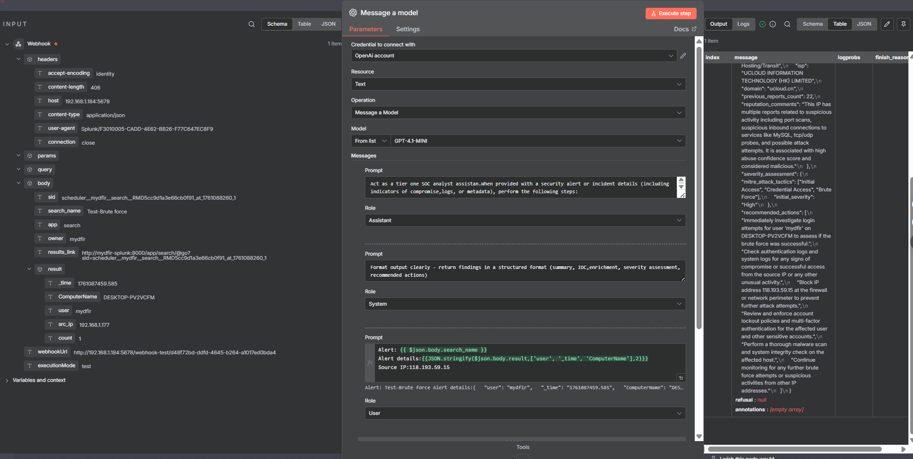
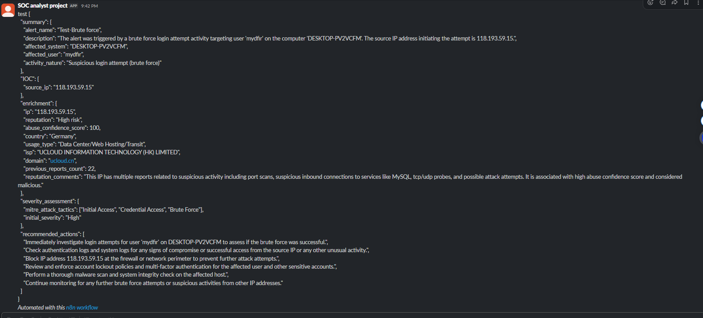

# 🛡️ SOC Automation Project — Splunk, n8n, ChatGPT & Slack

## 📌 Overview
This project builds a small **SOC-style automation pipeline** that detects suspicious Windows authentication activity in **Splunk**, triggers an automated workflow in **n8n**, enriches indicators with **AbuseIPDB**, summarizes findings with **ChatGPT**, and posts a structured alert to **Slack**.

## 🎯 What it does
- Collects Windows Security logs in Splunk (via Universal Forwarder)
- Detects repeated failed login attempts (**Event ID 4625**)
- Triggers a **Splunk alert → Webhook** to n8n
- n8n workflow:
  - Enriches source IP with **AbuseIPDB**
  - Uses **ChatGPT** to summarize, assess severity, and recommend next steps
  - Sends a formatted alert to **Slack**

## 🧰 Tech stack
- Splunk Enterprise (SIEM)
- Splunk Universal Forwarder (Windows log ingestion)
- n8n (Docker / Docker Compose)
- OpenAI (ChatGPT) node in n8n
- AbuseIPDB API (IP reputation enrichment)
- Slack API (alert delivery)
- VMware VMs (Windows 10 + Ubuntu)

## 🏗️ Architecture
```
Windows 10 (Security logs)
        ↓ (Universal Forwarder)
Splunk Enterprise (index + alert)
        ↓ (Webhook action)
n8n workflow
  ├─ AbuseIPDB enrichment (HTTP Request)
  ├─ ChatGPT analysis (summary / severity / actions)
  └─ Slack message (alert channel)
```

## 🔍 Splunk detection
Example detection used in this project:
```spl
index="mydfir-project" EventCode=4625
| stats count by _time, ComputerName, user, src_ip
```

## 📸 Screenshots (selected)
### 1) Splunk search showing EventCode=4625 events


### 2) Splunk stats view for alert-ready fields (user, host, src_ip)


### 3) n8n workflow overview (Webhook → ChatGPT → Slack + AbuseIPDB tool)


### 4) AbuseIPDB enrichment output


### 5) ChatGPT output (SOC-style summary, severity, recommended actions)


### 6) Final alert delivered to Slack


## ✅ Skills demonstrated
- SIEM alerting & log analysis (Splunk)
- Windows security telemetry ingestion
- Webhook-based alert forwarding
- SOAR-style automation with n8n
- Threat intel enrichment (AbuseIPDB)
- AI-assisted Tier 1 triage summaries
- Slack alerting & API integration

## 🚀 Future improvements
- Add additional detections (e.g., 4624 anomalies, privilege escalation, suspicious processes)
- Add more enrichment sources (VirusTotal, Shodan, etc.)
- Severity-based routing (different Slack channels / paging)
- Automatic containment actions (disable account, firewall block) in a safe lab environment

## 👤 Author
**Ensizziyo Ziraka**
